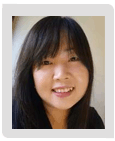
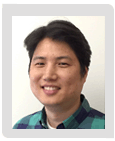
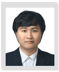
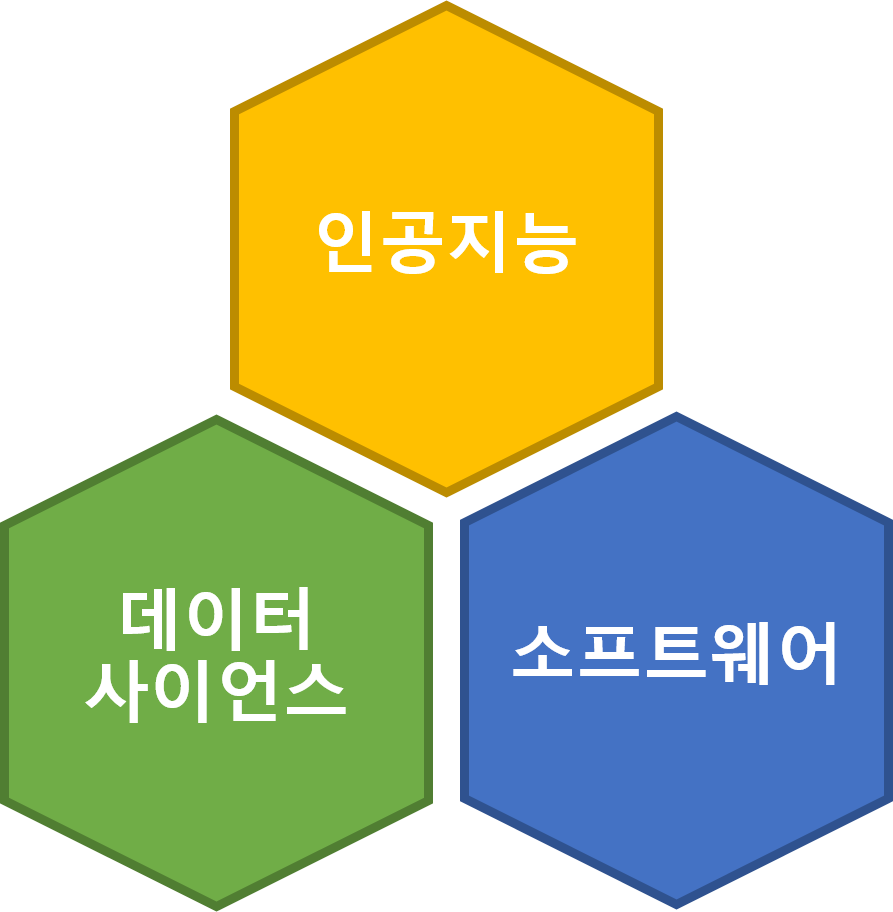
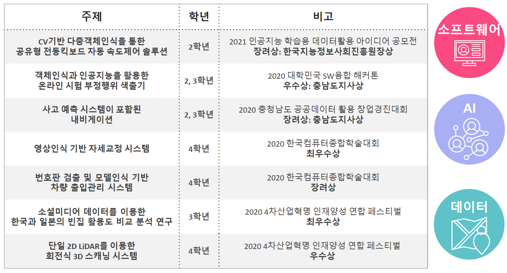

```{r xaringanExtra, echo=FALSE}
xaringanExtra::use_xaringan_extra(c("tile_view", "animate_css", "tachyons", "scribble", "freezeframe"))
```

# 차례

.f-130[
.lh-15[
1. 교수 소개
1. 교육 목표
1. 교과 과정
1. 학생 활동
1. 취업률
1. 학과 만족도
]
]

---
# 교수소개

.fl.w-100[
.pull-left-10[

]
.pull-left-40[
- 황석형 교수
- 일본 오사카대학교 공학박사
- 소프트웨어공학전공
]
.pull-left-10[

]
.pull-left-40[
- 김민경 교수
- 호주국립대학교 공학박사
- 네트워크사이언스전공
]
]

.fl.w-100[
.pull-left-10[

]
.pull-left-40[
- 김응희 교수
- 서울대학교 의학박사
- 의료정보학전공
]
.pull-left-10[

]
.pull-left-40[
- 김수환 교수
- 호주국립대학교 공학박사
- 컴퓨터비전전공
]
]

.fl.w-100[
.pull-left-10[

]
.pull-left-40[
- 송경환 교수
- 고려대학교 이학박사
- 암호학전공
]
]

---
# 김수환 교수

.lh-15[
- 학력사항
   - 학사 &nbsp;&nbsp; 서울대학교 기계항공공학부
   - 석사 &nbsp;&nbsp; University of Southern California, Computer Science
   - 박사 &nbsp;&nbsp; The Australian National University, Engineering and Computer Science
- 경력사항
   - 2019 - 현재 &nbsp;&nbsp;&nbsp; 선문대학교 AI소프트웨어학과 교수
   - 2018 - 2019 &nbsp;&nbsp; 미국 실리콘밸리 NVIDIA 본사 자율주행그룹 선임연구원
   - 2016 - 2018 &nbsp;&nbsp; 호주국립과학산업연구소 로보틱스그룹 연구원
   - 2015 - 2016 &nbsp;&nbsp; 미국 실리콘밸리 Bosch 연구소 증강현실연구팀 연구원
   - 2007 - 2011 &nbsp;&nbsp; 한국과학기술연구원 인지로봇연구단 연구원
   - 2005 - 2006 &nbsp;&nbsp; 한국전자통신연구원 디지털콘텐츠연구단 연구원
]

---
# 교육목표

.mt-06[
.center[
.f-200[.f-150.b[
4사산업혁명시대를 선도할<br>
.red[인공지능] .blue[소프트웨어] 및<br>
.green[데이터 사이언스] 전문가 양성
]
]
]
]

---
# 교과과정

.nt-01[
.center[

]
]

---
background-image: url("figs/ai-software.png")
background-position: 50% 50%
background-size: 100%

class: title-slide

---
# 학생활동

.nt-02[
.center[

]
]

---
# 취업률 100%

- 2021년 2월: 1회 졸업생 총 12명

.mt-03.f-130[
| &nbsp;&nbsp;구분&nbsp;&nbsp; | .center[국내학생] | 국제학생 |
|:---:|:---|:---:|
| 총원 | .center[6명] | 6명 |
| 분야 | &nbsp;&nbsp;2명: AI 및 IT 기업 <br> &nbsp;&nbsp;2명: 대학원 진학 <br> &nbsp;&nbsp;2명: 선문대학교 교직원&nbsp;&nbsp; | &nbsp;&nbsp;6명: AI 및 IT 기업&nbsp;&nbsp; |
]

---
# 재학생 학과 만족도 (2019)

.nt-02.f-80[
<table>
  <tr>
    <th>단과대</th>
    <th>학과</th>
    <th>만족도</th>
    <th>단과대</th>
    <th>학과</th>
    <th>만족도</th>
  </tr>
  <tr>
    <td rowspan="7">인문사회대학</td>
    <td>국어국문학과</td>
    <td>70.3</td>
    <td>신학대학</td>
    <td>신학과</td>
    <td>75.8</td>
  </tr>
  <tr>
    <td>글로벌한국학과</td>
    <td>70.2</td>
    <td rowspan="7">건강보건대학</td>
    <td>제약생명공학과</td>
    <td>70.7</td>
  </tr>
  <tr>
    <td>역사문화콘텐츠학과</td>
    <td>71.4</td>
    <td>식품과학수산생명의학부</td>
    <td>77.8</td>
  </tr>
  <tr>
    <td>미디어커뮤니케이션학과</td>
    <td>73.8</td>
    <td>스포츠과학부</td>
    <td>76.9</td>
  </tr>
  <tr>
    <td>상담심리사회복지학과</td>
    <td>72.3</td>
    <td>간호학과</td>
    <td>81.2</td>
  </tr>
  <tr>
    <td>시각디자인학과</td>
    <td>67.8</td>
    <td>물리치료학과</td>
    <td>80.2</td>
  </tr>
  <tr>
    <td>법경찰학과</td>
    <td>71.9</td>
    <td>치위생학과</td>
    <td>76.6</td>
  </tr>
  <tr>
    <td rowspan="9">공과대학</td>
    <td>스마트자동차공학부</td>
    <td>60.3</td>
    <td>응급구조학과</td>
    <td>85.0</td>
  </tr>
  <tr>
    <td>기계ICT융합공학부</td>
    <td>69.8</td>
    <td rowspan="7">글로벌비즈니스대학</td>
    <td>글로벌경영학과</td>
    <td>73.8</td>
  </tr>
  <tr>
    <td>전자공학과</td>
    <td>73.2</td>
    <td>국제레저관광학과</td>
    <td>77.4</td>
  </tr>
  <tr>
    <td>컴퓨터공학부</td>
    <td>74.8</td>
    <td>IT경영학과</td>
    <td>76.1</td>
  </tr>
  <tr>
    <td><b>AI소프트웨어학과</b></td>
    <td><b>84.0<b></td>
    <td>국제경제통상학과</td>
    <td>75.8</td>
  </tr>
  <tr>
    <td>건축사회환경학부</td>
    <td>76.6</td>
    <td>국제관계행정학부</td>
    <td>72.5</td>
  </tr>
  <tr>
    <td>환경생명화학공학과</td>
    <td>72.3</td>
    <td>글로벌행정학과</td>
    <td>80.0</td>
  </tr>
  <tr>
    <td>산업경영공학과</td>
    <td>71.2</td>
    <td>외국어자율전공학부</td>
    <td>68.7</td>
  </tr>
  <tr>
    <td>신소재공학과</td>
    <td>72.7</td>
    <td>계</td>
    <td>평균</td>
    <td>73.7</td>
  </tr>
</table>
]

---
# 재학생이 말하는 AI소프트웨어학과

.center[
<iframe width="800" height="450" src="https://www.youtube.com/embed/CkWsOaAjcLE" frameborder="0" allow="accelerometer; autoplay; clipboard-write; encrypted-media; gyroscope; picture-in-picture" allowfullscreen></iframe>
]

---
# 질문

.nt-03[
.center[

]
]